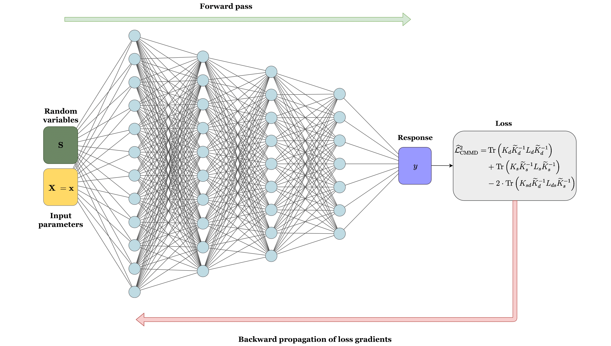

[A deep learning based surrogate model for stochastic simulators](https://arxiv.org/abs/2110.13809)\
Akshay Thakur and [Souvik Chakraborty](https://www.csccm.in/home)\
\
TensorFlow implementation of deep learning-based surrogate model for stochastic simulators. Generative neural network is used to approximate the stochastic response. A simple feed-forward neural network is used with a conditional maximum mean discrepancy (CMMD) loss-function. The CMMD allows to capture the discrepancy between the between the true response of the stochastic simulator and the distribution predicted by the neural network.

